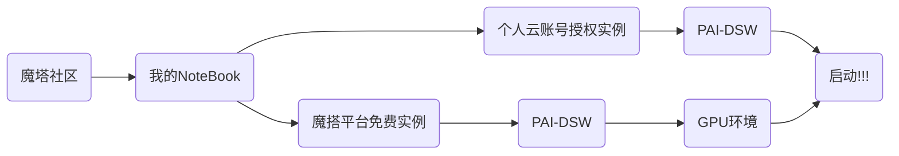

# **ByteBrain**

**信息时代您的计算机科学智能知识助手  
2024-Datawhale-AISummerCamp-IV   
Development-of-Large-scale-Model-Applications**

---

## 一键部署体验



`1、个人云账号授权实例：可以开通阿里云PAI-DSW试用，时长三个月`  
`2、魔塔平台免费实例：注册并绑定阿里云账号试用GPU，时长100h`

```powershell
#JupyterLab->Other->Terminal->Ctrl+V
git clone https://github.com/Stars-niu/ByteBrain.git
cd ByteBrain
pip install --upgrade pip setuptools
pip install -r requirements.txt
streamlit run app.py --server.address 127.0.0.1 --server.port 1001
```

### 问题注意:
- app.py根据使用的版本自行更换
- 重复打开应用时，可以更换监听端口的四个数字(即1001)，如果出现某端口已占用的情况。补充:127.0.0.1:表示服务器只监听本地回环地址，也就是说，只有在本机上的浏览器才能访问这个应用。(如果你想让其他设备也能访问，可以设置为 0.0.0.0) 1001:这个选项指定了Streamlit服务器监听的端口。这里设置为 1001，意味着应用程序将在 http://127.0.0.1:1001 地址上运行。

---

## RAG（Retrieval-Augmented Generation）  

```
#cmd
git clone https://github.com/Stars-niu/ByteBrain.git
cd ByteBrain
pip install --upgrade pip setuptools
pip install -r requirements.txt
streamlit run appRAG.py --server.address 127.0.0.1 --server.port 1002
```

```
#requirements.txt
streamlit==1.24.0
packaging
torch
torchvision==0.18.0
pandas
datasets
transformers
peft
modelscope
tb-nightly
sentencepiece
flash_attn 
einops
```

这个名字听起来可能有点复杂，但实际上它就是一个帮助人工智能更好地理解和回答问题的技术。让我们来简单地了解一下RAG是什么以及它是怎么工作的。

### RAG 是什么？
RAG 就像是一个人工智能助手的超级记忆功能。通常情况下，AI在回答问题时，会依赖于它之前学习过的大量知识。但是有时候这些知识可能不够全面或者不够新。这时候RAG就派上用场了——它可以让AI在回答问题的时候去查找最新的信息，就像我们人类在回答问题前会去查阅资料一样。

### RAG 怎么工作？
想象一下，如果你要写一篇关于恐龙的文章，你会怎么做？你可能会先回忆自己知道的一些基本事实，然后去图书馆或者上网找一些最新的研究资料来丰富你的文章。RAG的工作原理和这个很相似：
 - 理解问题：首先，AI需要理解用户提出的问题是什么意思。
 - 搜索信息：接下来，AI会在数据库中查找与问题相关的最新信息。这就像你去图书馆或者上网查资料。
 - 整合信息：找到相关信息后，AI会把这些信息和它已有的知识结合起来，形成一个更完整的答案。
 - 生成回答：最后，AI会根据整合好的信息来生成一个回答，这样就能提供准确且最新的答案给用户了。

### 为什么需要 RAG？
有时候，传统的AI模型可能不知道最新的数据或者事件，比如新的科学研究发现、新闻报道等。有了RAG的帮助，AI就可以实时地获取这些信息，并利用它们来生成更准确的回答。   
举个例子来说，如果有人问：“谁是当前世界上最富有的人？”没有RAG的AI可能会给出一个几年前的答案，而有RAG的AI则会去查找最新的财富排行榜来给出最新的名字。   

---

总的来说，RAG就像是给AI装上了“即时更新”的功能，让它们能够更好地适应不断变化的信息环境，从而提供更加准确和有用的答案。

---

## 微调（Fine tuning）
想象一下，你有一个非常聪明的助手，它已经学会了很多基本技能，比如理解和回答问题、翻译语言、识别图片上的东西等等。这个助手就像是一个大模型，它通过学习大量的信息来掌握这些技能。  
但是，这个助手虽然很聪明，它学到的东西可能并不完全适合你的具体需求。比如，你可能需要它特别擅长理解医学问题或者法律文件。这时候，我们就需要对助手进行一些特别的训练，让它在某些方面变得更加擅长。这个过程就叫做“微调”。

### 大模型微调的步骤大致如下：
选择一个大模型(这个模型已经通过学习大量的数据，具备了广泛的知识和技能):
 - 准备特定领域的数据：这些数据是专门为你的需要准备的，比如医学问题和答案的集合。
 - 微调过程：将这个大模型和你准备的数据一起训练一段时间。在这个过程中，模型会学习到如何更好地处理和理解你的特定领域数据。
 - 调整模型参数：在训练过程中，模型的一些内部参数会被调整，以更好地适应新的数据。
 - 评估和测试：训练完成后，我们会测试模型的表现，看看它是否已经足够擅长处理特定领域的任务。
 - 部署应用：如果测试结果令人满意，这个经过微调的模型就可以被用来解决实际问题了。

### 为什么需要微调？
提高准确性：微调可以帮助模型更准确地理解和处理特定类型的数据。
适应特定需求：每个领域都有其独特的术语和语境，微调可以让模型更好地适应这些需求。
提升效率：相比于从头开始训练一个模型，微调可以在较短的时间内提升模型在特定任务上的表现。

### 微调的好处：
灵活性：可以针对不同的需求快速调整模型。
成本效益：相比于全面重新训练，微调通常需要较少的资源和时间。
持续学习：随着时间的推移，可以不断地对模型进行微调，以适应新的情况和数据。

---

通过微调，我们可以让一个通用的智能助手变得更加专业和高效，更好地服务于特定的任务和需求。

---
