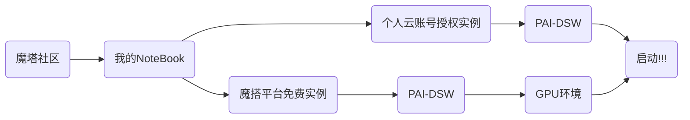

# ByteBrain
信息时代您的计算机科学智能知识助手  
（2024-Datawhale-AISummerCamp-IV-Development-of-Large-scale-Model-Applications）
---
# 一键部署体验

`1、个人云账号授权实例：可以开通阿里云PAI-DSW试用，时长三个月`  
`2、魔塔平台免费实例：注册并绑定阿里云账号试用GPU，时长100h`
```powershell
#JupyterLab->Other->Terminal->Ctrl+V
git clone https://github.com/Stars-niu/ByteBrain.git
pip install streamlit==1.24.0
cd ByteBrain
streamlit run app.py --server.address 127.0.0.1 --server.port 1001
```
---
