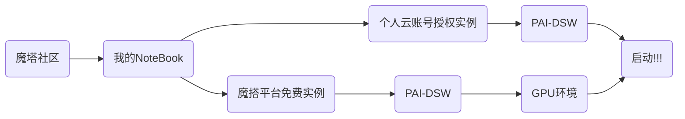

# **ByteBrain**

**信息时代您的计算机科学智能知识助手  
2024-Datawhale-AISummerCamp-IV   
Development-of-Large-scale-Model-Applications**

---
## 一键部署体验

`1、个人云账号授权实例：可以开通阿里云PAI-DSW试用，时长三个月`  
`2、魔塔平台免费实例：注册并绑定阿里云账号试用GPU，时长100h`
```powershell
#JupyterLab->Other->Terminal->Ctrl+V
git clone https://github.com/Stars-niu/ByteBrain.git
pip install streamlit==1.24.0
cd ByteBrain
streamlit run app.py --server.address 127.0.0.1 --server.port 1001
```

`app.py根据使用的版本自行更换`

---
## RAG（Retrieval-Augmented Generation）  
这个名字听起来可能有点复杂，但实际上它就是一个帮助人工智能更好地理解和回答问题的技术。让我们来简单地了解一下RAG是什么以及它是怎么工作的。
## RAG 是什么？
RAG 就像是一个人工智能助手的超级记忆功能。通常情况下，AI在回答问题时，会依赖于它之前学习过的大量知识。但是有时候这些知识可能不够全面或者不够新。这时候RAG就派上用场了——它可以让AI在回答问题的时候去查找最新的信息，就像我们人类在回答问题前会去查阅资料一样。
## RAG 怎么工作？
想象一下，如果你要写一篇关于恐龙的文章，你会怎么做？你可能会先回忆自己知道的一些基本事实，然后去图书馆或者上网找一些最新的研究资料来丰富你的文章。RAG的工作原理和这个很相似：
 - 理解问题：首先，AI需要理解用户提出的问题是什么意思。
 - 搜索信息：接下来，AI会在数据库中查找与问题相关的最新信息。这就像你去图书馆或者上网查资料。
 - 整合信息：找到相关信息后，AI会把这些信息和它已有的知识结合起来，形成一个更完整的答案。
 - 生成回答：最后，AI会根据整合好的信息来生成一个回答，这样就能提供准确且最新的答案给用户了。
## 为什么需要 RAG？
有时候，传统的AI模型可能不知道最新的数据或者事件，比如新的科学研究发现、新闻报道等。有了RAG的帮助，AI就可以实时地获取这些信息，并利用它们来生成更准确的回答。   
举个例子来说，如果有人问：“谁是当前世界上最富有的人？”没有RAG的AI可能会给出一个几年前的答案，而有RAG的AI则会去查找最新的财富排行榜来给出最新的名字。   

---
总的来说，RAG就像是给AI装上了“即时更新”的功能，让它们能够更好地适应不断变化的信息环境，从而提供更加准确和有用的答案。
